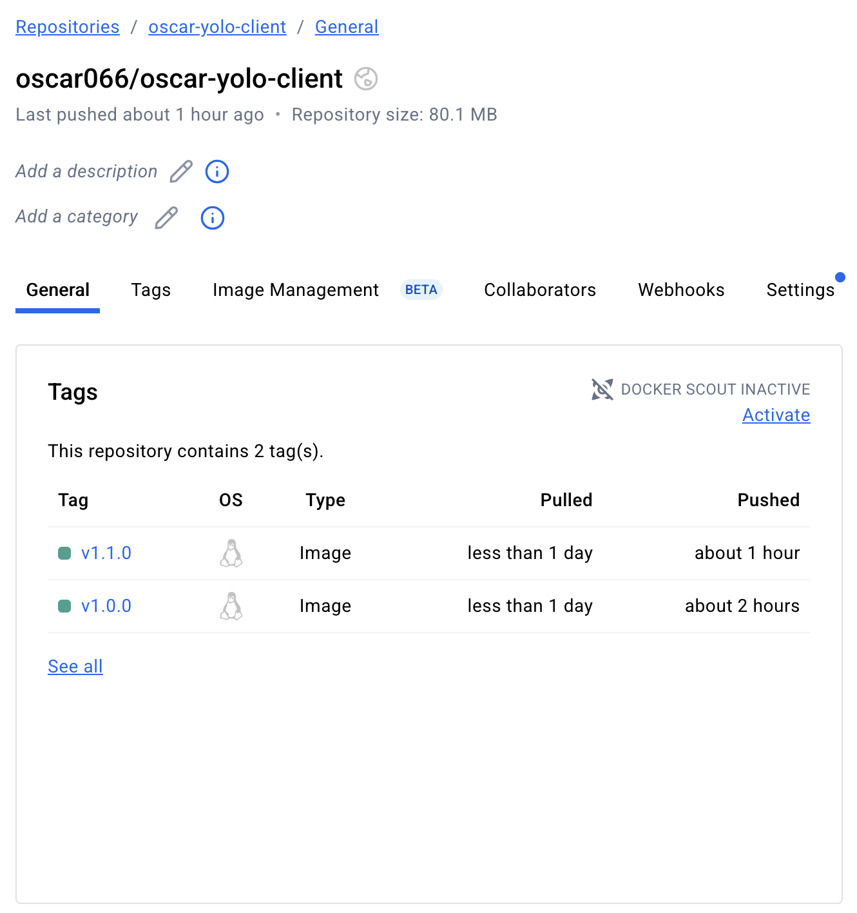
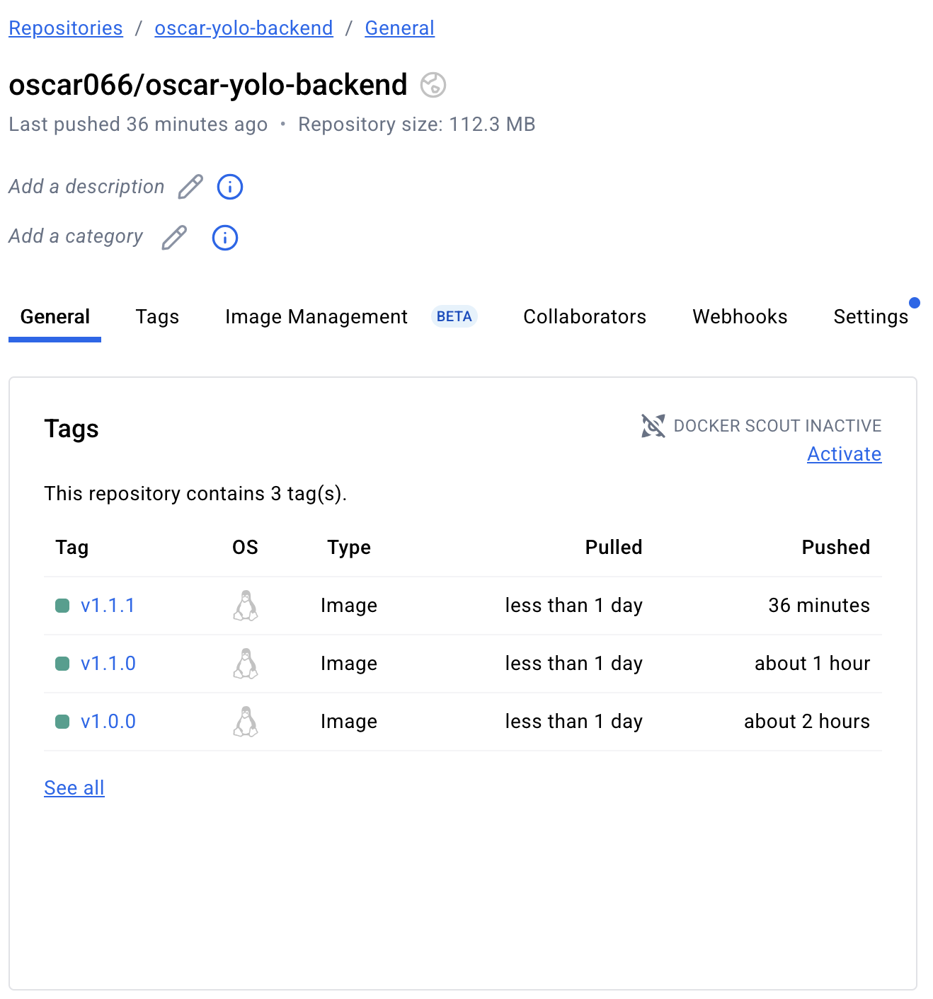

# Explanation of Implementation

This document details the reasoning, processes, and best practices applied during the containerization of the Yolo e-commerce application.

**Summary of Image Size Optimization:**

*   **Frontend:** The image was reduced from **~445MB** to a production-ready **66.7MB**.

*   **Backend:** After experimentation, the image was optimized to **188MB**, balancing size with the need for a stable, reproducible build.

### 1. Choice of the Base Image

The base images were selected with a focus on security, stability, and minimalism to ensure small and efficient final containers.

*   **Frontend (`oscar-yolo-client`):** A multi-stage build was implemented to create a minimal final image.

    *   **Build Stage:** `node:18-alpine` was chosen as the builder. It provides a recent Long-Term Support (LTS) version of Node.js within a lightweight Alpine environment, leading to faster and more secure dependency installation.

    *   **Final Stage:** `nginx:1.23-alpine` was selected to serve the application. Nginx is a high-performance, production-grade web server ideal for static content. This approach, combined with using the optimized React production build, was the key to reducing the final image size from **~445MB to 66.7MB**.

*   **Backend (`oscar-yolo-backend`):** A multi-stage approach was also adopted after a deliberate experimentation process.
    *   **Build Stage:** `node:18-alpine` was used to create a consistent and secure environment for installing dependencies.
    *   **Final Stage:** `alpine:3.19`, a recent and stable version of Alpine Linux, was used as the final base. Node.js and npm were then installed onto this minimal OS.

    *   *Note on Experimentation:* A single-stage build using `node:18-alpine` was initially tested. While simpler, it resulted in a larger-than-expected image (~280MB). By reverting to a multi-stage build and using up-to-date base images, a final size of **188MB** was achieved—a successful balance between size, security, and build stability.

*   **Database (`app-ip-mongo`):**
    *   `mongo:noble` was chosen. Using an official, recent tag from Docker Hub ensures reliability, access to the latest features, and active maintenance with security updates.

    *   *Note on Experimentation:* The project was initially tested with `mongo:5.0`. However, this older version caused a `featureCompatibilityVersion` crash when it encountered data from a newer MongoDB instance. Opting for the latest stable tag (`noble`) resolved these compatibility issues while providing better long-term security.

---

### 2. Dockerfile Directives Used

Several key Dockerfile directives were instrumental in creating optimized and cache-friendly images:

*   **`FROM ... AS build`**: Initiates a multi-stage build, allowing the separation of the build environment from the final, minimal runtime environment.

*   **`WORKDIR /app`**: Sets the default working directory, ensuring an organized and predictable file structure within the container.

*   **`COPY package*.json ./`**: This command is intentionally run before other `COPY` commands to leverage Docker's layer caching. The time-consuming `npm install` step is only re-run if dependencies in `package.json` actually change.

*   **`RUN npm install`**: Executes the dependency installation. For the backend, `npm install --omit=dev` was also tested as part of the optimization process.

*   **`COPY --from=build ...`**: The core of the multi-stage pattern, this selectively copies only necessary build artifacts (like the compiled React app or the `node_modules` directory) from the build stage to the final stage.

*   **`EXPOSE`**: Documents the network port that the application listens on inside the container (e.g., `80` for Nginx, `5000` for the backend).

*   **`CMD ["node", "server.js"]`**: Defines the default command to execute when the container starts.

---

### 3. Docker-compose Networking

A custom bridge network was implemented to connect the services securely and efficiently.

*   **Custom Bridge Network:** A network named `app-net` was created to provide an isolated environment, preventing interference with other containers on the host.

*   **Service Discovery:** The primary benefit of this network is service discovery. Containers can communicate using their service names as hostnames. This was critical for fixing the backend's database connection, which now correctly targets the hostname `app-ip-mongo` via its `MONGODB_URI`.

*   **Port Allocation:** Ports are mapped from the host to the container (`HOST:CONTAINER`). The frontend is mapped with `"80:80"` to expose Nginx to standard web traffic, and the backend is mapped with `"5000:5000"` to expose the API.

---

### 4. Docker-compose Volume Definition and Usage

Data persistence for the database was achieved using a named volume.

*   **Named Volume:** A volume named `app-mongo-data` was defined and mounted to `/data/db` inside the `app-ip-mongo` container.

*   **Usage and Persistence:** MongoDB stores all its data in `/data/db`. Mapping this path to a host volume decouples the data's lifecycle from the container's. This ensures data persistence across container restarts and was crucial during debugging, as it preserved the data that helped identify the `featureCompatibilityVersion` error.

---

### 5. Git Workflow Used to Achieve the Task

A structured Git workflow was used to document the development process and decision-making.

1.  **Fork and Clone**: The original repository was forked and cloned locally.

2.  **Feature Branching**: Some Work was performed on a feature branch to isolate changes from the main branch.

3.  **Atomic Commits**: Changes were grouped into logical, atomic commits with descriptive messages following a conventional format to clearly explain each step.

4.  **Iterative Process**: The commit history reflects a deliberate, iterative development process, including experimentation with different build strategies, debugging, and implementing final, improved solutions.

5.  **Pull Request**: A pull request is the standard final step to review and merge changes into the main branch.

---

### 6. Successful Running and Debugging Measures Applied

The application now runs successfully. Several key issues were identified and resolved during the process:

1.  **Backend Connection Failure (`ECONNREFUSED`):** The backend initially tried to connect to `localhost`.

    *   **Solution:** This was fixed by using Docker's service discovery and setting the `MONGODB_URI` environment variable in `docker-compose.yml` to point to the database's service name (`app-ip-mongo`).

2.  **Frontend Build Failure (`ERR_OSSL_EVP_UNSUPPORTED`):** The production build failed due to an incompatibility between the project's older `react-scripts` package and the updated OpenSSL library in Node.js 18.

    *   **Solution:** The `NODE_OPTIONS=--openssl-legacy-provider` flag was added to the `npm run build` command in the `client/Dockerfile` to enable a legacy compatibility mode.

3.  **Database Crash (`featureCompatibilityVersion`):** The `mongo:5.0` container crashed because the persistent volume contained data created by a newer MongoDB version.

    *   **Solution:** The application was shut down (`docker-compose down`) and the old, incompatible volume was removed (`docker volume rm`). This allowed a fresh, compatible database to be created on the next startup.

---

### 7. Good Practices and Image Naming Standards

Best practices were followed for versioning and naming to ensure clarity and maintainability.

*   **Image Naming Convention:** Images were named using the standard `username/repository:version` format (e.g., `oscar066/oscar-yolo-client:v1.1.0`).

*   **Semantic Versioning (SemVer):** A `MAJOR.MINOR.PATCH` versioning scheme was used to track changes meaningfully.

    *   **`v1.1.0`** was used for the client after a significant refactor (implementing the multi-stage build). This is a `MINOR` change.

    *   **`v1.1.1`** was used for the backend after updating its base images for security and stability. This is a `PATCH` change, as it's a backwards-compatible improvement.

---

### 8. Screenshot of Deployed Image on DockerHub

The final container images were successfully tagged and pushed to Docker Hub.

**Client Image on Docker Hub (`oscar066/oscar-yolo-client:v1.1.0`)**

**Backend Image on Docker Hub (`oscar066/oscar-yolo-backend:v1.1.1`)**

