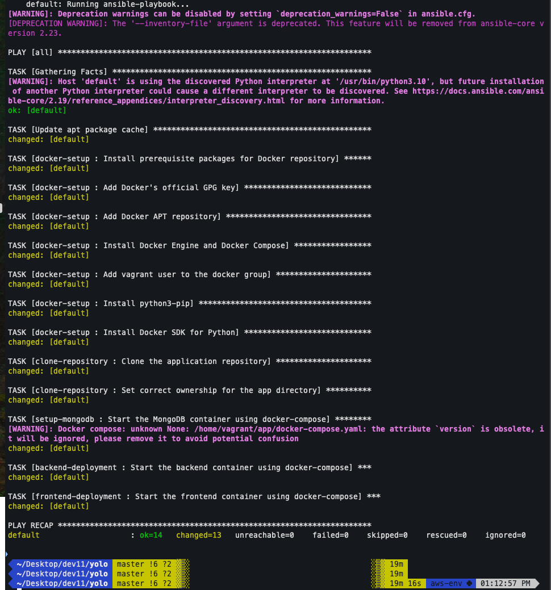
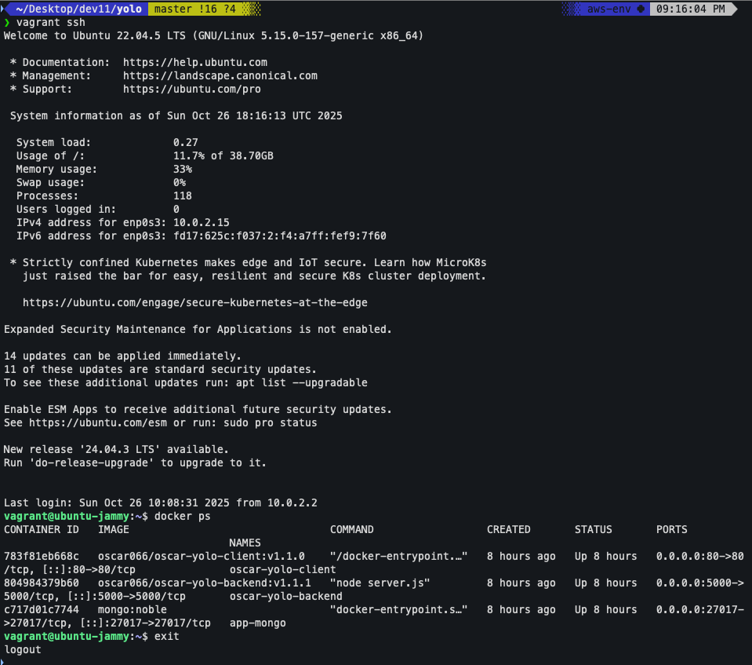

# Project Explanation: Configuration Management with Vagrant & Ansible

This document provides a detailed breakdown of the methodology, technical decisions, and best practices employed to automate the deployment of the Yolo e-commerce application using Vagrant for environment provisioning and Ansible for configuration management.

### 1. Project Initialization and Environment Setup

The project began with a clean slate, establishing a robust and reproducible virtual environment as the foundation for our automation.

*   **Fresh Start:** To ensure a clean and predictable build, any default or pre-existing `Vagrantfile` or Ansible configuration files (`ansible.cfg`, `hosts`) were removed. The project was built from the ground up, following the assignment's recommended directory structure (`ansible-playbook/`, `roles/`, etc.) as a guide for organization.

*   **Vagrant Environment (`Vagrantfile`):** Vagrant was used to provision a consistent and isolated development environment.

    *   **Base Box (`ubuntu/jammy64`):** Ubuntu 22.04 LTS (Jammy Jellyfish) was selected as the base operating system. This choice was driven by its stability, long-term support, and our prior familiarity with it from class exercises, which ensured a reliable and known starting point.

    *   **VM Resources:** The virtual machine was allocated **2GB of RAM** and **2 vCPUs**. This is a crucial configuration, as running Docker and building multiple Node.js containers is a resource-intensive process. This allocation prevents performance bottlenecks and ensures a smooth provisioning process.

    *   **Network Configuration:** Port forwarding was configured to allow access to the containerized services from the host machine's browser.
        *   `host: 8080 -> guest: 80`: Maps the host's port 8080 to the guest's port 80, exposing the Nginx frontend.
        *   `host: 5000 -> guest: 5000`: Maps the host's port 5000 to the guest's port 5000, exposing the backend API for testing and communication.

### 2. Ansible Project Structure

A structured, role-based approach was adopted for the Ansible configuration, promoting modularity, reusability, and clarity.

*   **Role-Based Architecture:** The playbook was broken down into distinct, single-responsibility roles. This is a core Ansible best practice that makes the automation easier to read, manage, and debug.

*   **`ansible-galaxy init`:** Instead of manually creating directories, the standard `ansible-galaxy init <role_name>` command was used to generate each role. This creates a complete, standardized directory structure (`tasks`, `handlers`, `vars`, etc.), adhering to professional Ansible development workflows.

### 3. The Ansible Playbook: An Orchestration Blueprint

The main `playbook.yml` file serves as the central orchestrator, defining the sequence of operations from a bare OS to a fully running application.

```yaml
# ansible-playbook/playbook.yml
---
- hosts: all
  become: yes
  pre_tasks:
    - name: Update apt package cache
      apt:
        update_cache: yes
        cache_valid_time: 3600
  roles:
    - role: docker-setup
    - role: clone-repository
    - role: setup-mongodb
    - role: backend-deployment
    - role: frontend-deployment
```

*   **Sequential Execution:** The order of roles is critical and was deliberately chosen to reflect the application's dependencies:
    1.  **System Preparation (`pre_tasks`):** The `apt` cache is updated first to ensure all subsequent package installations use the latest sources.
    2.  **Docker Setup:** Docker is the core dependency for the entire application stack and must be installed first.
    3.  **Clone Repository:** The application's source code, including the crucial `docker-compose.yml` file, must be present on the VM before any containers can be deployed.
    4.  **Database -> Backend -> Frontend:** The services are deployed in order of dependency. The database must be running before the backend can connect to it, and the backend must be running before the frontend can make API calls to it.

### 4. Deep Dive into Ansible Roles

Each role has a specific and well-defined purpose.

*   **`docker-setup`:** This role is responsible for preparing the host to run containers. It reliably installs Docker Engine, the Docker Compose v2 plugin, and the Python Docker SDK, which is a required dependency for Ansible's `docker_compose_v2` module.

*   **`clone-repository`:** This role uses the `ansible.builtin.git` module to clone the application's source code from its GitHub repository into `/home/vagrant/app`. It also ensures the `vagrant` user has correct ownership of the files, preventing permission errors during the deployment phase.

*   **`setup-mongodb`**, **`backend-deployment`**, **`frontend-deployment`:** These three roles work together to deploy the application services sequentially. They each use the `community.docker.docker_compose_v2` module to target and launch a *specific service* from the `docker-compose.yml` file. This fulfills the project requirement of deploying each component individually while still leveraging the power and networking benefits of Docker Compose.

### 5. Overcoming Challenges: A Debugging Journey

The development process involved several technical hurdles, each of which provided a valuable learning opportunity and was resolved with a specific, targeted solution.

1.  **Challenge: GPG Key Verification Failure:**
    *   **Problem:** The initial attempt to add Docker's APT repository failed with a GPG key error. The `apt` system could not verify the authenticity of the repository.
    *   **Solution:** The tasks in the `docker-setup` role were refactored. We replaced the manual file-based GPG key setup with the more direct and reliable `ansible.builtin.apt_key` module, which correctly registered the key with the system and resolved the trust issue.

2.  **Challenge: Deprecated Ansible Module:**
    *   **Problem:** The first attempt at deployment failed because the `community.docker.docker_compose` module has been removed from recent versions of its collection, as it relied on the end-of-life `docker-compose v1`.
    *   **Solution:** We migrated to the modern, supported `community.docker.docker_compose_v2` module in all three deployment roles.

3.  **Challenge: Invalid `build` Parameter:**
    *   **Problem:** The new `docker_compose_v2` module has stricter parameter requirements than its predecessor. Our playbook failed because the module no longer accepts boolean values (`yes`/`no`) for the `build` parameter.
    *   **Solution:** The tasks were updated to use the required string values: `'never'` for the pre-built MongoDB image and `'always'` for the backend and frontend services, which are built from `Dockerfiles`.

### 6. Git Workflow

A disciplined Git workflow was used to ensure a clean and understandable project history. The process involved cloning the repository, performing work on a feature branch, and making small, atomic commits with descriptive messages for each logical change (e.g., "feat: Create Vagrantfile for environment setup," "fix: Correct GPG key error in docker-setup role").

### 7. Final Verification

The success of the automation was verified by two key indicators:
1.  **Ansible Play Recap:** The `vagrant up` command completed with a `failed=0` status in the final recap, confirming that all provisioning tasks executed successfully.
2.  **Application Accessibility:** The deployed e-commerce application was fully accessible and functional in a web browser at **`http://localhost:8080`**.

---

### Screenshots of Successful Deployment

1.  **Successful `vagrant up` Completion:** A screenshot of the terminal showing the successful completion of the `vagrant up` command, including the Ansible playbook recap with `failed=0`.

    

2.  **Running Application:** A screenshot of the frontend application running in a web browser, demonstrating that the automated deployment was successful and the application is fully functional.

    

3.  **Docker Containers:** A screenshot of the Docker containers running inside the Vagrant VM, showing that all services (frontend, backend, database) are up and running.

    