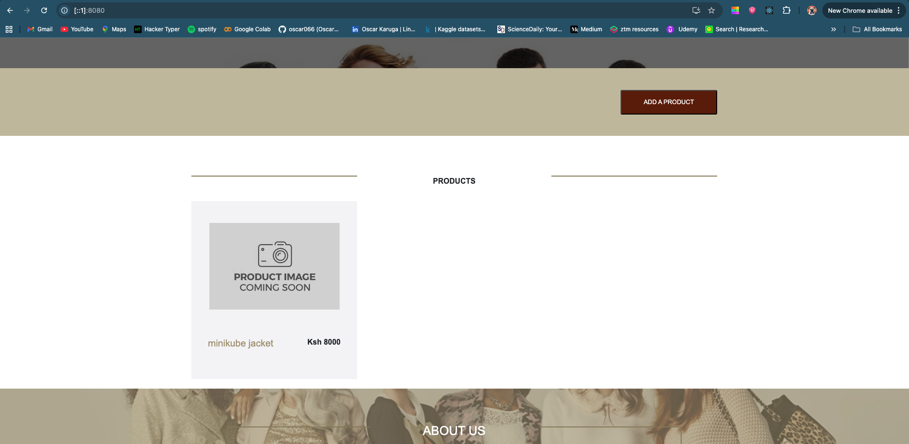

# Project Explanation: Kubernetes Orchestration on Minikube & GKE

This document provides a detailed breakdown of the methodology, technical decisions, and best practices employed to orchestrate the "Yolo" e-commerce application. The project involved transitioning from a local `docker-compose` environment to a fully managed Kubernetes deployment, first validated on a local Minikube cluster and then deployed to a production-grade Google Kubernetes Engine (GKE) cluster.

### 1. Final Kubernetes Manifest Structure

To ensure a clean and organized deployment, all Kubernetes resources were defined in a dedicated `manifests` directory. This structure separates concerns and simplifies management.

```
manifests/
├── 00-ingress.yaml
├── mongo-statefulset.yaml
├── mongo-service.yaml
├── backend-deployment.yaml
├── backend-service.yaml
├── frontend-deployment.yaml
├── frontend-service.yaml
└── backend-config.yaml
```

### 2. Stage 1: Local Validation with Minikube

Before deploying to a live cloud environment, the entire application stack was first deployed and debugged on a local Minikube cluster. This allowed for rapid iteration and validation of the Kubernetes manifests.

#### Kubernetes Object Selection

The choice of Kubernetes objects was driven by best practices for orchestrating multi-component applications:

*   **Deployments:** Used for the stateless `frontend` and `backend` services. Deployments are ideal for managing stateless applications, providing capabilities like rolling updates, self-healing, and easy scalability.

*   **StatefulSet:** Deliberately chosen for the MongoDB database to earn the extra points and, more importantly, because it is the industry standard for running stateful applications on Kubernetes. Unlike a Deployment, a StatefulSet provides a **stable, unique network identifier** (e.g., `mongo-statefulset-0`) and **stable, persistent storage**. Its `volumeClaimTemplates` feature automatically provisions a unique PersistentVolumeClaim for each pod, ensuring data persistence and integrity even if the pod is rescheduled.

*   **Services (`ClusterIP`):** The `mongo-service`, `backend-service`, and `frontend-service` were all configured with `type: ClusterIP`. This exposes them via a stable DNS name *inside* the cluster, allowing the services to communicate with each other securely and efficiently.

*   **Ingress:** An Ingress resource was implemented to act as the single, intelligent entry point for all external traffic. This is vastly superior to exposing multiple services via `LoadBalancer`, as it centralizes routing rules and is more cost-effective in a cloud environment.

#### A Detailed Local Debugging Journey

The transition to Minikube presented several critical challenges that were systematically resolved:

1.  **Challenge: Initial API Call Failure:** The first deployment was successful, but the frontend could not add products. Browser console logs showed API calls were being directed to `localhost:5000`.

    *   **Solution:** The frontend React code was modified to use relative paths (e.g., `/api/products`) instead of hardcoded URLs. This makes the frontend portable and allows the Ingress to handle routing.

2.  **Challenge: Ingress Routing Issues:** After introducing the Ingress, API calls were still failing. Debugging revealed that requests to `/api/products` were being incorrectly routed to the frontend pod, which returned its `index.html` file, causing the React app to crash.

    *   **Solution:** The Ingress manifest was refined with unambiguous, `pathType: Prefix` rules for both `/api` and `/`. This ensures that traffic is correctly bifurcated between the backend and frontend services without any complex rewrite rules.

3.  **Challenge: `minikube tunnel` Instability (`ERR_CONNECTION_REFUSED`):** The final local hurdle was being unable to access the application. The `minikube tunnel` command proved unreliable, failing to bind to the local port correctly due to conflicts.

    *   **Solution:** The architecture was corrected by ensuring all internal services, including the `frontend-service`, were set to `type: ClusterIP`, establishing the Ingress as the sole entry point. To bypass the tunnel instability, the more direct and robust `kubectl port-forward` command was used to establish a stable connection for final validation. The exact command used was:
    ```bash
    kubectl port-forward -n ingress-nginx <ingress-controller-pod-name> 8080:80
    ```

### Screenshot of the fully functional application running on Minikube:





### 3. Stage 2: Cloud Deployment with Google Kubernetes Engine (GKE)

With the application fully functional on Minikube, the validated manifests were used to deploy to GKE.

#### Environment Setup: The `gcloud` CLI

The process began by preparing the local machine for cloud management by installing the Google Cloud SDK and running the initialization command:

```bash
gcloud init
```
This command was used to authenticate with a GCP account and set the default project (`careful-acumen-475916-r8`) and compute zone (`us-central1-a`).

#### GKE Cluster Provisioning & Initial Hurdles

The process of creating a production-ready, two-node GKE cluster involved overcoming several one-time cloud setup challenges:

1.  **Challenge: "Default Network Not Found":** The initial cluster creation command failed because the project's Compute Engine API had not been enabled, and thus the default VPC network did not exist.

    *   **Solution:** The necessary service and network were created with the following commands:
        ```bash
        gcloud services enable compute.googleapis.com
        gcloud compute networks create default --subnet-mode=auto
        ```

2.  **Cluster Creation:** With the prerequisites in place, the cluster was successfully provisioned using the full, unabridged command:
    ```bash
    gcloud container clusters create yolo-cluster \
      --num-nodes=2 \
      --machine-type=e2-medium \
      --zone=us-central1-a \
      --project=careful-acumen-475916-r8
    ```

3.  **Challenge: `gke-gcloud-auth-plugin` Not Found:** After creating the cluster, `kubectl` could not connect due to a missing authentication helper.

    *   **Solution:** The required plugin was installed, and `kubectl` was connected to the new cluster using these commands:
        ```bash
        gcloud components install gke-gcloud-auth-plugin
        gcloud container clusters get-credentials yolo-cluster --zone us-central1-a
        ```

### 4. Stage 3: GKE-Specific Configuration & Final Debugging

Deploying to a managed cloud environment revealed differences from Minikube that required specific adjustments.

1.  **Challenge: Ingress Not Provisioning an IP:** After applying the manifests with `kubectl apply -f manifests/`, the Ingress resource remained indefinitely in a "pending" state.

    *   **Diagnosis:** The manifest specified `ingressClassName: nginx`, which is correct for Minikube's addon, but not for GKE, which uses its own powerful, native Ingress controller.

    *   **Solution:** The `ingressClassName` line was removed from the `00-ingress.yaml` manifest, allowing the default GKE Ingress controller to claim the resource and begin provisioning a Google Cloud Load Balancer.

2.  **Challenge: `502 Bad Gateway` on API Calls:** The application loaded, but adding a product failed with a `502` error. This indicated the Google Cloud Load Balancer had marked the backend pods as "UNHEALTHY".

    *   **Diagnosis:** GKE's default health checks were pinging the backend's root path (`/`), which did not have a defined route, resulting in `404` errors and a failed health check.

    *   **Solution:** A GKE-specific `BackendConfig` resource was created to define a custom health check on a valid API path (`/api/products`). This `BackendConfig` was then linked to the `backend-service` via an annotation in `05-backend-service.yaml`, ensuring the Load Balancer's health checks would succeed.

### 5. Final Rubric Objectives

This project successfully met the key assessment objectives:

*   **Choice of Kubernetes Objects:** A **StatefulSet** was correctly implemented for the database to ensure data persistence and stable network identity. **Deployments** were used for stateless application components.

*   **Method Used to Expose Pods:** An **Ingress** was used as the single, managed entry point for all external traffic, which is the best practice for exposing HTTP/S applications on GKE.

*   **Use-of Persistent Storage:** Persistent storage was achieved using the `volumeClaimTemplates` feature of the StatefulSet, which automatically provisions a Google Persistent Disk for the database, decoupling the data's lifecycle from the pod's.

*   **Good Practices:** Consistent **labels** were added to all Kubernetes resources for improved organization and observability. The final solution is robust, scalable, and follows cloud-native design patterns.

### 6. Git Workflow
A disciplined Git workflow was used to ensure a clean and understandable project history. The process involved performing work on a feature branch to isolate changes from the master branch. The project's evolution was documented through a series of small, atomic commits, each with a descriptive message following a conventional format.

### 7. Final Verification

The application is now fully functional and accessible on the internet via the public IP address provided by the GKE Ingress Controller. The ability to add items to the cart confirms that the entire stack—frontend, backend, and persistent database—is working correctly in a fully orchestrated cloud environment.

*   **Live URL:** **[http://136.110.235.135](http://136.110.235.135)**

### Screenshot of the fully functional application running on GKE:


