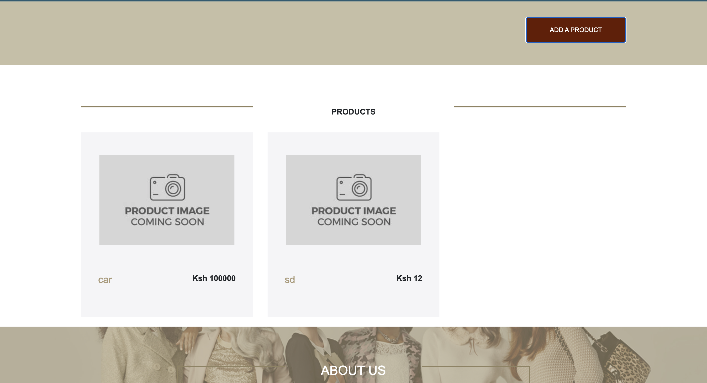
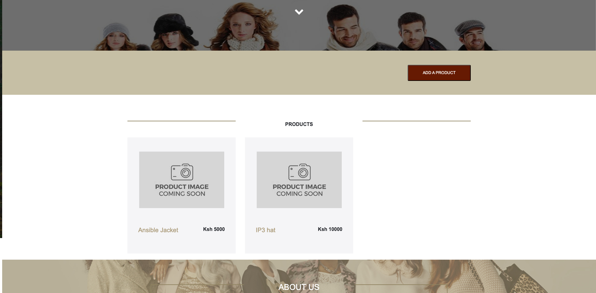

# Yolo E-Commerce Application (Automated & Containerized Deployment)

This repository contains the source code for the Yolo E-Commerce application. This project automates the deployment of its microservices (frontend, backend, and database) using a combination of technologies for a seamless and reproducible setup.

There are two methods to run this application:
1.  **Automated Deployment (Recommended):** A one-command setup using Vagrant and Ansible.
2.  **Manual Deployment:** For users who want to interact directly with Docker and Docker Compose.

The entire process, including the automation architecture, containerization decisions, and debugging, is detailed in the `IP2_explanation.md` for using Docker and Docker compose and `IP3_explanation.md` for using Vagrant and Ansible files.

## Technology Stack

*   **Frontend:** React.js
*   **Backend:** Node.js, Express.js
*   **Database:** MongoDB
*   **Web Server:** Nginx
*   **Containerization:** Docker, Docker Compose
*   **Virtual Environment:** Vagrant
*   **Configuration Management:** Ansible

---

## Method 1: Automated Deployment with Vagrant & Ansible (Recommended)

This method uses Vagrant to provision a virtual machine and Ansible to automatically install all dependencies, clone the repository, and deploy the containerized application.

### Prerequisites

*   **Git:** To clone the repository.
*   **Vagrant:** To manage the virtual machine.
*   **VirtualBox:** As the virtualization provider for Vagrant.

### Instructions

1.  **Clone the repository** to your local machine:
    ```bash
    git clone https://github.com/oscar066/yolo.git
    ```

2.  **Navigate into the project directory:**
    ```bash
    cd yolo
    ```

3.  **Launch the Environment:**
    Run the single `vagrant up` command from the root of the project:
    ```bash
    vagrant up
    ```
    This command will:
    *   Create and configure an Ubuntu 22.04 virtual machine.
    *   Run the Ansible playbook to install Docker, Docker Compose, and all other dependencies.
    *   Clone the application source code into the VM.
    *   Build and launch the application containers in the correct order.

    **Note:** The first run will take several minutes as it needs to download the virtual machine image and build the Docker containers.

### Accessing the Application

Once `vagrant up` completes successfully, the application will be running inside the VM and accessible from your local machine's browser.

*   **Frontend Website:**
    *   Navigate to **`http://localhost:8080`** in your web browser.
    *   *(This port is forwarded from port 80 inside the VM, where the Nginx container is running).*

### Managing the Environment

*   **To stop the virtual machine:**
    ```bash
    vagrant halt
    ```
*   **To destroy the virtual machine completely:**
    ```bash
    vagrant destroy -f
    ```
*   **To re-run only the Ansible provisioning:**
    ```bash
    vagrant provision
    ```

---

## Method 2: Manual Deployment with Docker Compose

This method is for users who prefer to run the application directly on their host machine using Docker, without the Vagrant virtual machine.

### Prerequisites

*   **Git:** To clone the repository.
*   **Docker Desktop:** This includes both the Docker Engine and Docker Compose.

### Instructions

1.  **Clone and navigate into the repository** (if you haven't already).

2.  **Build and Run the Containers:**
    From the root directory of the project, run the following command:
    ```bash
    docker-compose up --build
    ```
    *   `--build`: This flag tells Docker Compose to build the images from the `Dockerfile`s before starting the containers.

3.  **Running in the Background (Detached Mode):**
    ```bash
    docker-compose up -d --build
    ```

### Accessing the Services (Manual Mode)

*   **Frontend Website:**
    *   Navigate to **`http://localhost`** in your web browser. *(Note: This uses port 80, unlike the Vagrant method).*

*   **Backend API:**
    *   The API is running at `http://localhost:5000`.

*   **Database:**
    *   Connect to the database at `mongodb://localhost:27017` using a client like MongoDB Compass.

### Stopping the Application (Manual Mode)

*   **The Recommended Method (stops and removes containers):**
    ```bash
    docker-compose down
    ```

*   **To Stop and Remove the Database Volume (Warning: Deletes all data):**
    ```bash
    docker-compose down -v
    ```

---

## Project Screenshots

**Frontend Running**


**Frontend Running before adding a product**



**Frontend Running after adding a product**


**Frontend Running after adding a product on the server running after running Vagrant Up command**
