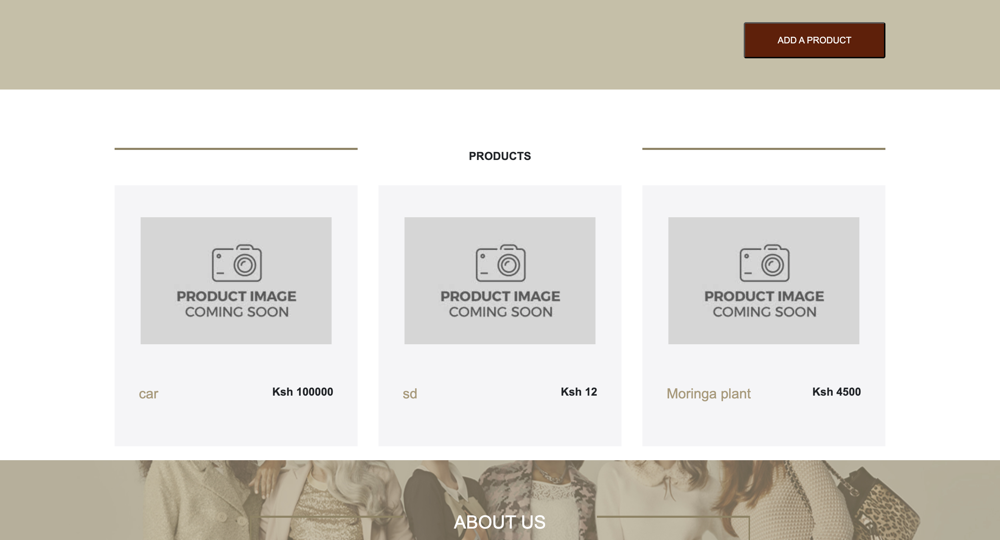

# Yolo E-Commerce Application (Containerized & Orchestrated Deployment)

This repository contains the source code for the Yolo E-Commerce application. This project demonstrates multiple ways to deploy its microservices (frontend, backend, and database), from a local containerized setup to a fully automated and orchestrated cloud deployment.

There are three methods to run this application, representing a progression from local development to a production-grade cloud environment:

1.  **Automated Staging Deployment:** A one-command setup using Vagrant and Ansible.
2.  **Manual Local Deployment:** For users who want to interact directly with Docker and Docker Compose.
3.  **Production-Grade Orchestration:** A fully orchestrated deployment to a Kubernetes cluster, validated locally with Minikube and deployed to Google Kubernetes Engine (GKE).

The entire process, including architectural decisions and detailed debugging steps for each stage, is documented in the explanation files: `IP2_explanation.md` (Docker), `IP3_explanation.md` (Ansible), and `IP4_explanation.md` (Kubernetes).

## Technology Stack

*   **Frontend:** React.js
*   **Backend:** Node.js, Express.js
*   **Database:** MongoDB
*   **Web Server:** Nginx
*   **Containerization:** Docker, Docker Compose
*   **Orchestration:** **Kubernetes**, **Minikube**, **GKE (Google Kubernetes Engine)**
*   **Virtual Environment:** Vagrant
*   **Configuration Management:** Ansible

---

## Method 1: Automated Deployment with Vagrant & Ansible

This method uses Vagrant to provision a virtual machine and Ansible to automatically install all dependencies, clone the repository, and deploy the containerized application. It's ideal for creating a consistent staging or development environment.

### Prerequisites

*   **Git:** To clone the repository.
*   **Vagrant:** To manage the virtual machine.
*   **VirtualBox:** As the virtualization provider for Vagrant.

### Instructions

1.  **Clone the repository** to your local machine:
    ```bash
    git clone https://github.com/oscar066/yolo.git
    ```

2.  **Navigate into the project directory:**
    ```bash
    cd yolo
    ```

3.  **Launch the Environment:**
    Run the single `vagrant up` command from the root of the project:
    ```bash
    vagrant up
    ```
    This command will create and configure an Ubuntu 22.04 VM, run the Ansible playbook to install Docker and all dependencies, and launch the application containers.

### Accessing the Application

*   **Frontend Website:** Navigate to **`http://localhost:8080`** in your web browser.

### Managing the Environment

*   **To stop the virtual machine:** `vagrant halt`
*   **To destroy the virtual machine completely:** `vagrant destroy -f`

---

## Method 2: Manual Deployment with Docker Compose

This method is for users who prefer to run the application directly on their host machine using Docker, without the Vagrant virtual machine.

### Prerequisites

*   **Git:** To clone the repository.
*   **Docker Desktop:** This includes both the Docker Engine and Docker Compose.

### Instructions

1.  **Clone and navigate into the repository.**
2.  **Build and Run the Containers:**
    From the root directory of the project, run the following command:
    ```bash
    docker-compose up --build
    ```

### Accessing the Services (Manual Mode)

*   **Frontend Website:** Navigate to **`http://localhost`** in your web browser. *(Note: This uses port 80).*

### Stopping the Application (Manual Mode)

*   To stop and remove the containers:
    ```bash
    docker-compose down
    ```

---

## Method 3: Kubernetes Deployment (Minikube & GKE)

This is the most advanced, production-grade deployment method, using Kubernetes to orchestrate the application. The process is validated locally on Minikube before being deployed to a live GKE cluster.

### Prerequisites

*   **Git:** To clone the repository.
*   **kubectl:** The Kubernetes command-line tool.
*   **Minikube:** For local cluster validation.
*   **Google Cloud SDK (`gcloud`):** For deploying to GKE.

### Stage 3A: Local Deployment with Minikube

This step deploys the application to a local Minikube cluster for testing.

1.  **Clone and navigate into the repository.**
2.  **Start Minikube and enable the Ingress addon:**
    ```bash
    minikube start
    minikube addons enable ingress
    ```
3.  **Apply all Kubernetes manifests:**
    ```bash
    kubectl apply -f manifests/
    ```
4.  **Accessing the Application (Minikube):**
    The `minikube tunnel` command can be unreliable. The most robust way to access the application is to port-forward directly to the Ingress controller.

    *   First, open a **new, dedicated terminal** and run this command to create the connection:
        ```bash
        # Note: Get the pod name via `kubectl get pods -n ingress-nginx`
        kubectl port-forward -n ingress-nginx <ingress-controller-pod-name> 8080:80
        ```
    *   Then, navigate to **`http://localhost:8080`** in your web browser.

### Stage 3B: Cloud Deployment to GKE

This is the final step, deploying the application to a live, managed Kubernetes cluster on Google Cloud.

1.  **Prerequisites:** Ensure you have created a GKE cluster and configured `kubectl` to point to it (detailed steps are in `IP4_explanation.md`).
2.  **Apply all Kubernetes manifests to GKE:**
    ```bash
    kubectl apply -f manifests/
    ```
3.  **Get the Public IP Address:**
    GKE will automatically provision a Google Cloud Load Balancer. To find its public IP, run this command and wait for the `ADDRESS` field to be populated (this can take 3-5 minutes):
    ```bash
    kubectl get ingress yolo-ingress
    ```

### Accessing the Live Application on GKE

The application is now fully deployed and accessible on the internet.

*   **Live URL:** **[http://136.110.235.135](http://136.110.235.135)**

---

## Project Screenshots

#### Previous Deployments (Docker & Vagrant/Ansible)



#### Kubernetes/GKE Deployment

**Application running on GKE, accessed via the public IP address:**


**Successfully adding a product on the live GKE deployment:**
